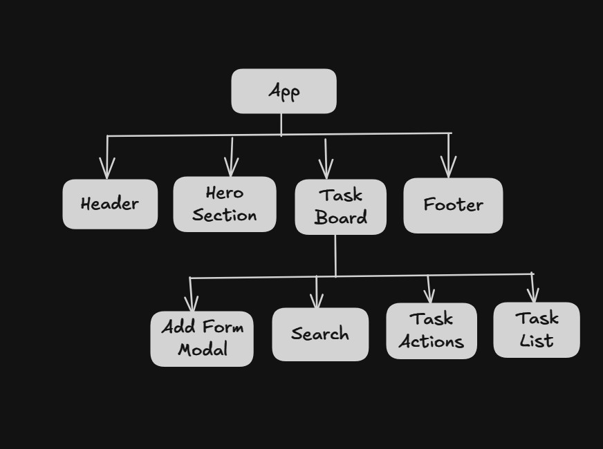

# Tasker

Tasker is a modern and minimal task management application built with React.
It helps you organize, prioritize, and track your tasks with a clean and intuitive user interface.

</br>

## Live Demo

https://tasker-theta-eight.vercel.app/

</br>

## Features

- Add, edit, and delete tasks
- Search tasks by title
- Assign priority levels (High, Medium, Low)
- Add tags to categorize tasks
- Delete all tasks at once

</br>

## Component Map

Below is a simplified breakdown of the component structure used in the project:



</br>

## Tech Stack

- React
- JavaScript (ES6+)
- Tailwind
- Vite

</br>

## Installation

```bash
# Clone the repository
git clone https://github.com/aponroy0/tasker.git

# Navigate into the project
cd tasker

# Install dependencies
npm install

# Start development server
npm run dev
```

</br>

## Usage

1. Open the application in your browser.
2. Add tasks with a title, description, priority, and tags.
3. Edit or delete tasks as needed.
4. Use the search bar to filter tasks.
5. Use the Delete All button to clear the full list.
